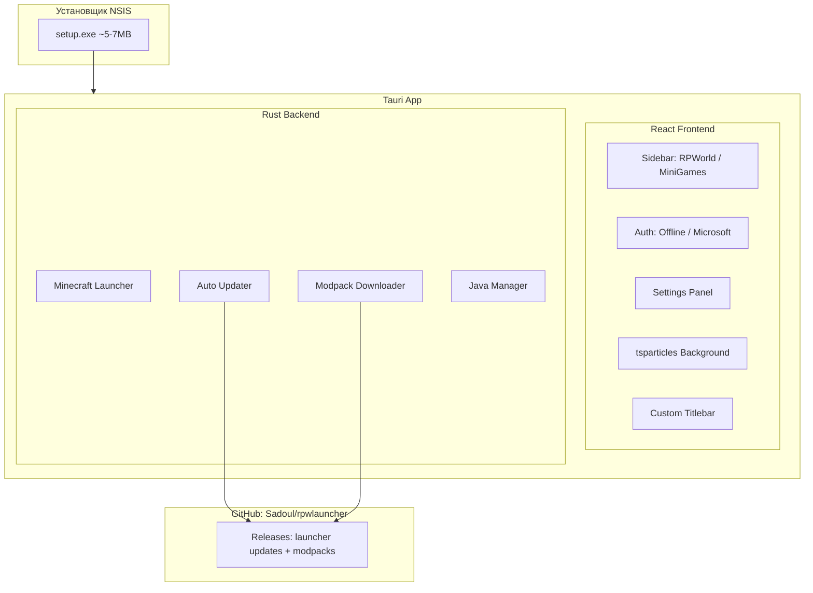

<!--firebender-plan
name: RPW Minecraft Launcher
overview: Создание Minecraft лаунчера RPWorld на Tauri v2 (Rust + React + TypeScript) с glassmorphism UI, анимациями, автообновлением через GitHub и поддержкой офлайн/Microsoft авторизации.
todos:
  - id: init-project
    content: "Инициализация Tauri v2 + React + TypeScript проекта со всеми зависимостями"
  - id: custom-titlebar
    content: "Кастомный titlebar с кнопками Свернуть/Развернуть/Закрыть"
  - id: ui-glassmorphism
    content: "Glassmorphism стили, градиентный фон, CSS переменные"
  - id: particles-bg
    content: "Фоновые анимированные частицы (tsparticles)"
  - id: sidebar-nav
    content: "Sidebar с навигацией: RPWorld, Мини-игры, Настройки"
  - id: auth-panel
    content: "Панель авторизации: офлайн никнейм + Microsoft OAuth"
  - id: game-panel
    content: "Главная панель с кнопкой Играть и прогресс-баром"
  - id: rust-launcher
    content: "Rust backend: скачивание Minecraft (версии, libraries, assets) и запуск"
  - id: rust-modpacks
    content: "Система скачивания модпаков с GitHub Releases"
  - id: rust-updater
    content: "Автообновление лаунчера через GitHub Releases"
  - id: java-manager
    content: "Автоопределение и установка Java"
  - id: nsis-installer
    content: "Настройка NSIS установщика в tauri.conf.json"
  - id: animations-polish
    content: "Финальная полировка анимаций и переходов"
-->

# RPWorld Launcher (RPW)

## Стек технологий

- **Backend**: Rust (Tauri v2) -- управление файлами, скачивание, запуск Minecraft, автообновление
- **Frontend**: React + TypeScript + Vite -- UI интерфейс
- **UI библиотеки**: Framer Motion (анимации), tsparticles (частицы), CSS glassmorphism
- **Размер .exe**: ~3-5 МБ (Tauri использует встроенный WebView2 Windows)
- **Установщик**: NSIS (встроен в Tauri) -- маленький .exe установщик (~5-7 МБ)

## Архитектура



## Структура проекта

```
RPWLauncher/
  src-tauri/           -- Rust backend (Tauri)
    src/
      main.rs          -- точка входа
      commands/
        auth.rs        -- авторизация (offline + Microsoft OAuth)
        launcher.rs    -- запуск Minecraft
        downloader.rs  -- скачивание сборок с GitHub
        updater.rs     -- автообновление лаунчера
        java.rs        -- поиск/установка Java
      lib.rs
    tauri.conf.json    -- конфигурация Tauri + NSIS installer
    Cargo.toml
  src/                 -- React frontend
    components/
      Titlebar.tsx     -- кастомные кнопки Свернуть/Развернуть/Закрыть
      Sidebar.tsx      -- выбор режима RPWorld / Мини-игры
      ParticlesBg.tsx  -- фоновые частицы
      AuthPanel.tsx    -- панель авторизации
      GamePanel.tsx    -- главная панель с кнопкой "Играть"
      SettingsPanel.tsx
    styles/
      globals.css      -- glassmorphism, градиенты, анимации
    App.tsx
    main.tsx
  package.json
```

## UI дизайн

- **Фон**: темный градиент (deep purple -> dark blue) с анимированными частицами
- **Панели**: glassmorphism (backdrop-filter: blur, полупрозрачный белый фон, тонкая светлая рамка)
- **Sidebar слева**: вертикальное меню с иконками режимов (RPWorld, Мини-игры, Настройки)
- **Кастомный titlebar**: без стандартной рамки Windows, свои кнопки свернуть/развернуть/закрыть с hover-анимациями
- **Кнопка "Играть"**: большая с градиентом и glow-эффектом
- **Анимации**: плавные переходы между экранами (Framer Motion), hover-эффекты на всех элементах

## Ключевые функции

### 1. Авторизация
- **Офлайн**: ввод никнейма, сохранение в локальный конфиг
- **Microsoft OAuth**: авторизация через браузер, получение Xbox/Minecraft токенов

### 2. Запуск Minecraft
- Rust backend скачивает vanilla Minecraft (версии, libraries, assets) через официальный API Mojang
- Запускает Java процесс с нужными аргументами
- Прогресс-бар скачивания в UI

### 3. Модпаки (сборки)
- Каждый режим (RPWorld, MiniGames) имеет свою конфигурацию на GitHub
- Лаунчер проверяет версию сборки и скачивает/обновляет из GitHub Releases
- Файл `modpack.json` в репозитории описывает версию, файлы, Minecraft версию

### 4. Автообновление лаунчера
- При запуске проверяет GitHub Releases (`Sadoul/rpwlauncher`) на новую версию
- Скачивает новый .exe и перезапускается
- Используется Tauri built-in updater plugin

### 5. Java Manager
- Автоматическое определение установленной Java
- Если Java не найдена -- предложение скачать (Adoptium/Temurin)

## Этапы реализации

1. Инициализация проекта Tauri v2 + React + TypeScript
2. Кастомный titlebar и базовая структура UI
3. Glassmorphism стили, градиенты, частицы
4. Sidebar с навигацией между режимами
5. Панель авторизации (офлайн + Microsoft)
6. Rust backend: скачивание и запуск Minecraft
7. Система скачивания модпаков с GitHub
8. Автообновление лаунчера через GitHub Releases
9. Настройка NSIS установщика
10. Финальная полировка анимаций и UI
